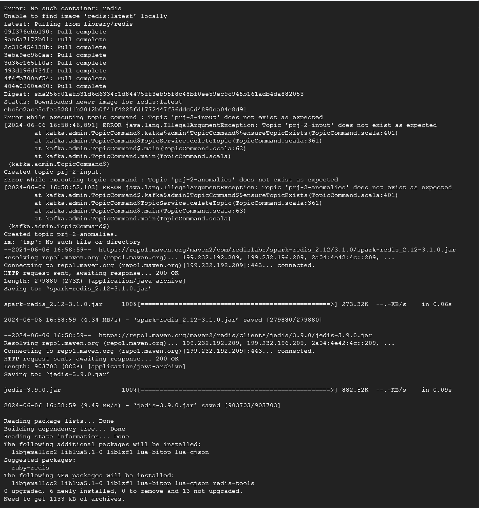
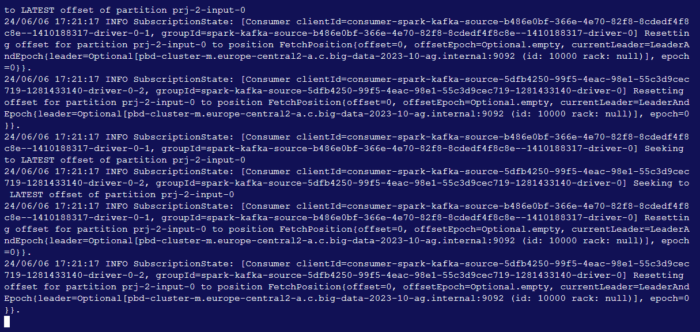
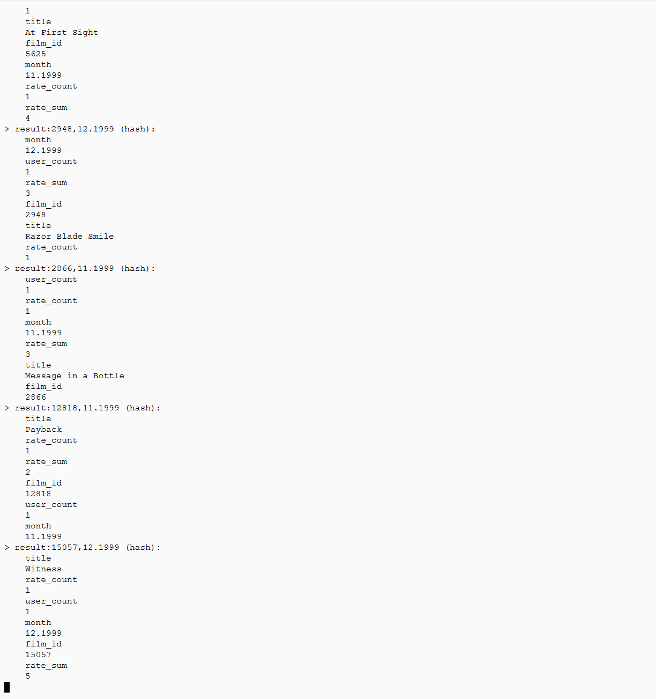
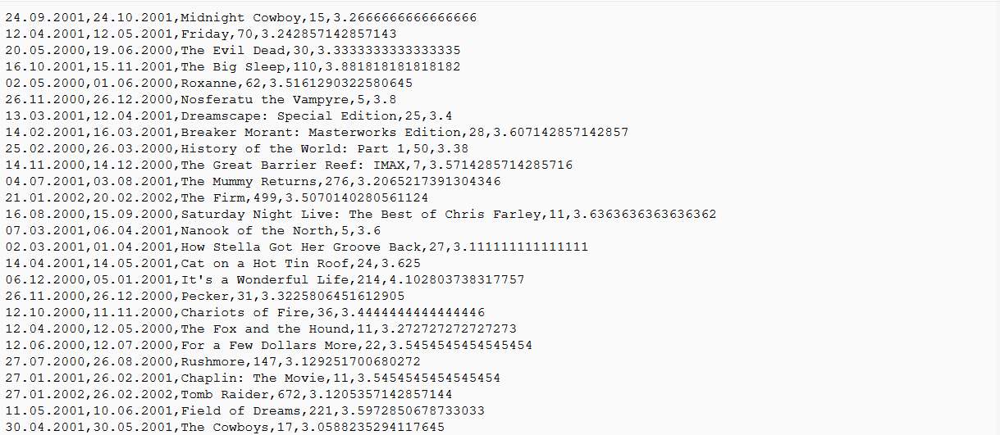

# Sprawozdanie

BigData Stream Processing, Netflix Prize Data, Spark Structured Streaming

## Producent; skrypty inicjujące i zasilający

#### Uruchomienie klastra
```bash
gcloud dataproc clusters create ${CLUSTER_NAME} \
--enable-component-gateway --region ${REGION} --subnet default \
--master-machine-type n1-standard-4 --master-boot-disk-size 50 \
--num-workers 2 --worker-machine-type n1-standard-2 --worker-boot-disk-size 50 \
--image-version 2.1-debian11 --optional-components DOCKER,ZOOKEEPER \
--project ${PROJECT_ID} --max-age=2h \
--metadata "run-on-master=true" \
--initialization-actions \
gs://goog-dataproc-initialization-actions-${REGION}/kafka/kafka.sh
```

#### Skrypt inicjujący środowisko
Skrypt `./setup.sh` przeprowadza całą inicjalizację środowiska, łączenie z tworzeniem miejsc utrzymywania obrazów czasu rzeczywistego i anomalii.
Przykładowy efektu uruchomienia:

W wyniku działania skryptu mogą pojawić się błędy - jak na powyższym screenshocie. Są one wynikiem próby usunięcia dla pewności nieistniejącego tematu Kafki. Można je zignorować.

#### Zasilanie Kafki danymi
Zasinie danymi realizowane jest przez skrypt `./producer.sh`. Nie przyjmuje on żadnych argumentów.

## Utrzymanie obrazu czasu rzeczywistego – tryb A
```python
#Wczytywanie danych
#Oceny
source = spark.readStream \
.format("kafka") \
.option("kafka.bootstrap.servers", f"{host_name}:9092") \
.option("subscribe", "prj-2-input") \
.option("startingOffsets", "latest") \
.option("failOnDataLoss", "false") \
.load()
data = source.select(expr("CAST(value AS STRING)").alias("value"))

#Filmy
movies = spark.read.option("header", True).csv("gs://pojemnik/projekt2/movie_titles.csv")

#Wstepne formatowanie danych
split_columns = split(data["value"], ",")

data = data.withColumn("date", to_timestamp(split_columns[0], "yyyy-MM-dd")) \
.withColumn("film_id", split_columns[1]) \
.withColumn("user_id", split_columns[2]) \
.withColumn("rate", split_columns[3].cast(IntegerType()))
data = data.drop("value")

#Wyliczenie agregat
win = data.groupBy(
    window("date", "30 days"), data.film_id) \
    .agg(
        count("rate").alias("rate_count"),
        sum("rate").alias("rate_sum"),
        approx_count_distinct("user_id").alias("user_count")
    )
win = win.withColumn("month", date_format(win.window.end, "MM.yyyy"))

#Dołączenie danych o filmach, wyznaczenie kolumny klucza dla Redisa
win = win.join(movies, movies.ID == win.film_id) \
    .withColumnRenamed("Title", "title") \
    .withColumn("key", concat(col("film_id"), lit(","), col("month")))
win = win.drop("window", "ID", "Year")

#Zapis do Redisa
query = win.writeStream \
.outputMode("update") \
.foreachBatch (
    lambda batchDF, _:
    batchDF.write
        .mode("append") \
        .format("org.apache.spark.sql.redis") \
        .option("table", "result") \
        .option("key.column", "key") \
        .option("host", host_name) \
        .save()
) \
.start()
```

## Utrzymanie obrazu czasu rzeczywistego – tryb C
Wczytywanie danych analogicznie jak w trybie A
```python
#Wyliczenie agregat
win = data.withWatermark("date", "30 days") \
    .groupBy(
        window("date", "30 days"), data.film_id) \
        .agg(count("rate").alias("rate_count"),
        sum("rate").alias("rate_sum"),
        approx_count_distinct("user_id").alias("user_count")
    )
win = win.withColumn("month", date_format(win.window.end, "MM.yyyy"))

#Dołączenie danych o filmach, wyznaczenie kolumny klucza dla Redisa
win = win.join(movies, movies.ID == win.film_id) \
.withColumnRenamed("Title", "title") \
.withColumn("key", concat(col("film_id"), lit(","), col("month")))
win = win.drop("window", "ID", "Year")

#Zapis do Redisa
query = win.writeStream \
.outputMode("append") \
.foreachBatch (
    lambda batchDF, _:
    batchDF.write
        .mode("append") \
        .format("org.apache.spark.sql.redis") \
        .option("table", "result") \
        .option("key.column", "key") \
        .option("host", host_name) \
        .save()
) \
.start()

```

## Wykrywanie anomalii
```python
#Wczytywanie danych
#Oceny
source = spark.readStream \
.format("kafka") \
.option("kafka.bootstrap.servers", f"{host_name}:9092") \
.option("subscribe", "prj-2-input") \
.option("startingOffsets", "latest") \
.option("failOnDataLoss", "false") \
.load()
data = source.select(expr("CAST(value AS STRING)").alias("value"))

#Filmy
movies = spark.read.option("header", True).csv("gs://pojemnik/projekt2/movie_titles.csv")

#Wstepne formatowanie danych
split_columns = split(data["value"], ",")

data = data.withColumn("date", to_timestamp(split_columns[0], "yyyy-MM-dd")) \
.withColumn("film_id", split_columns[1]) \
.withColumn("user_id", split_columns[2]) \
.withColumn("rate", split_columns[3].cast(IntegerType()))
data = data.drop("value")

#Wyznaczenie wartości zagregowanych dla okna o zadanym rozmiarze
anomalies_window = data.withWatermark("date", f"{anomaly_window_length} days") \
.groupBy(window("date", f"{anomaly_window_length} days", "1 day"), data.film_id) \
.agg(
    count("rate").alias("rate_count"),
    sum("rate").alias("rate_sum")) \
.select(
    col("film_id"),
    col("rate_count"),
    date_format(col("window").start, "dd.MM.yyyy").alias("window_start"),
    date_format(col("window").end, "dd.MM.yyyy").alias("window_end"),
    (col("rate_sum") / col("rate_count")).alias("avg_rate"),
    col("rate_count")
)

#Sprawdzenie warunków wystąpienia anomalii, dołączenie danych o filmach
anomalies = anomalies_window.where(
    (anomalies_window.rate_count > anomaly_min_rate_count) &
    (anomalies_window.avg_rate > anomaly_min_avg_rate)
).join(movies, movies.ID == anomalies_window.film_id) \
.drop("ID", "Year", "film_id")

#Formatowanie wyniku dla wyjścia w Kafce
anomalies_formatted = anomalies.select(concat(
    col("window_start"),
    lit(","),
    col("window_end"),
    lit(","),
    col("Title"),
    lit(","),
    col("rate_count"),
    lit(","),
    col("avg_rate"),
).alias("value"))

#Zapis wyniku do tematu Kafki
anomalies_output = anomalies_formatted.writeStream \
.format("kafka") \
.option("kafka.bootstrap.servers", f"{host_name}:9092") \
.option("topic", "prj-2-anomalies") \
.option("checkpointLocation", "/tmp/anomaly_checkpoints/") \
.start()
```

## Program przetwarzający strumienie danych; skrypt uruchamiający
Przetwarzanie uruchamiane jest skryptem `process.sh`.

Argumenty (w kolejności podawania):
- tryb obsługi obrazu czasu rzeczywistego - `string` - `a` dla trybu A i `c` dla trybu C
- długość okresu czasu wykrywania anomalii wyrażona w dniach - `integer` (parametr `D` z opisu projektu)
- minimalna liczba ocen dla odnotowania anomalii - `integer` (parametr `L` z opisu projektu)
- minimalna średnia ocena dla odnotowania anomalii - `integer` (parametr `O` z opisu projektu)

Przykładowe wyjście z `process.sh` - gotowość do pracy:


Warianty uruchomienia prztwarzania:
- Wariant 1 - tryb A, anomalie nie występują:
`./process.sh a 30 2 3`
- Wariant 2 - tryb C, anomalie występują stosunkowo często:
`./process.sh a 30 2 3`

## Miejsce utrzymywania obrazów czasu rzeczywistego – skrypt tworzący
Miejsce utrzymywania obrazów czasu rzeczywistego jest tworzone przez skrypt `setup.sh`. Nie trzeba uruchamiać go ponownie.

## Miejsce utrzymywania obrazów czasu rzeczywistego – cechy
Redis jest bazą danych typu klucz wartość, która wspiera drobnoziarnistą aktualizację (próba zapisu wartości dla istniejącego klucza powoduje nadipsanie jego aktualnej wartości). W przypadku przetwarzania strumieni danych istotną zaletą jest wysoka szybkość działania, a także możliwość łatwego rozproszenia i zwiększania liczby węzłów przechowujących dane. W projekcie wykorzystano tylko jeden węzeł, ale obsługa większej liczby nie wymaga zmian w kodzie aplikacji.

## Konsument: skrypt odczytujący wyniki przetwarzania
#### Obrazy czasu rzeczywstego
Do odczytu danych z obrazów czasu rzeczywistego można zastosować skrypt `reader_realtime.sh`. Odczytuje on cyklicznie dane zapisywane do miejsca utrzymywania (Redisa). Skrypt przyjmuje argument, który określa w sekundach jak często ma następować ponowne odczytanie danych. Domyślna wartość to 5 sekund.

Przykładowy wynik przetwarzania czasu rzeczywistego:


#### Wyniki wykrywania anomalii
Do odczytu wyników wykraywania anomalii stosuje się skrypt `reader_anomalies.sh`.

Przykładowy wynik wykrywania anomalii:


## Czyszczenie i ponowne uruchomienie projektu
Przed ponownym uruchomieniem projektu po jego zatrzymaniu należy uruchomić skrypt `reset.sh`. Można rónież użyć `setup.sh`, ale `reset` nie pobiera ponowanie danych wejściowych, bibliotek sparka i nie instaluje klienta Redisa, w związku z czym jest dużo szybszy.